<!---

This file is used to generate your project datasheet. Please fill in the information below and delete any unused
sections.

You can also include images in this folder and reference them in the markdown. Each image must be less than
512 kb in size, and the combined size of all images must be less than 1 MB.
-->
## Objective

The objective of this project is to design a RAM sense amplifier for the University of Waterloo's ECE298A Tiny-Tapout RAM group

A sense amplifier is a specialized circuit in RAM that amplifies very small voltage differences on paired bitlines. During a read operation, memory cells apply a small differential voltage between the bitlines, which this circuit will convert into logic-level output that digital circuitry can reliably interpret.

The initial goal parameters for this project were as follows:

| Parameter | Value | Reasoning  |
|-------|-------|-------|
| Sensitivity | 10mV | This parameter will depend on how much the bit line voltages change before reading, which in turn is based on the relative capacitance of the storage cell and the bit line. A very conservative estimate is 10mV. |
| Gain | 43.5dB | Assume a minimal reliable logical high detection at 1.5V, and read only moves the data lines by 10mV. Target gain would then be 150x or 43.5dB.  |
| Speed | 0.17V/ns slew rate | Assuming a clock speed of 50MHz (TinyTapeout max of 66MHz) gives 20ns per clock cycle. Assume we want the amplification to take no longer than 30% of the clock cycle. This gives 6ns, so approx. 1V/6ns. The final value will require coordination with other teams to determine how long an amplified read takes, and what else needs to be accomplished in a clock cycle that might reduce the amount of time allowable for amplification.  |
| Power Consumption | 10mW | Rough estimation for now. The exact power can be extracted from simulations and specific targets can be set on what is realistic.  |

## Schematic

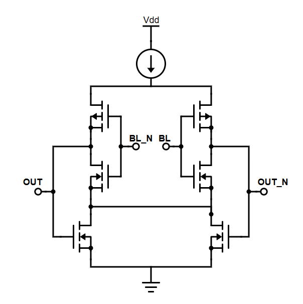

## How it works

During a read operation, the bitlines in_p and in_m carry a very small voltage difference produced by the selected memory cell. This small difference is inverted and dramatically amplified by the CMOS's at each input. 

These amplified voltages feed into the gates of a pair of NMOS's which either reduce or increase the amount of current flowing through the circuit. This feedback works to correct the common mode of the output

## Design & Testing Process

### Design #1 (Oct 1 - Nov 8)

The original design for this sense amp was two CMOS amplifiers with cross coupled CMOS's for common-mode correction.

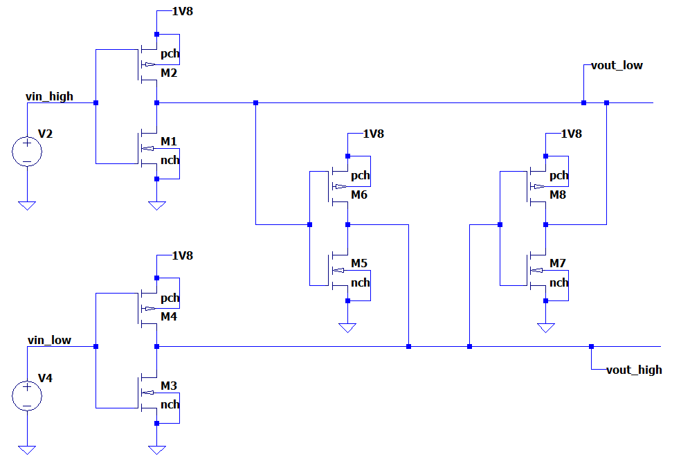

We spent a while on this design tweaking the width and length values to try to obtain faster response, better rail to rail swing, and a output common mode of 0.9V with an input common mode of 0.9V. However, there were multiple issues with this design that ultimately made it unfeasible.

Firstly, the cross coupled CMOS's had to be made extremely small in order to not overpower the initial inverters. This made the common mode correction extremely slow.

Secondly, we encountered an issue with the output not demonstrating the expected inversion. For some reason, the output (although showing otherwise correct behaviour due to our tweaks) would often not invert depending on the input. We were unable to determine the cause of this, with our main theory being that noise causes the circuit to flip in one direction early, and the input inverters being unable to overpower the cross coupled inverters (which were already near the minimum size) once the output was already rail-to-rail.

Ultimately, we were provided an alternative design.

### Design #2 (Nov 8 - Nov 19)

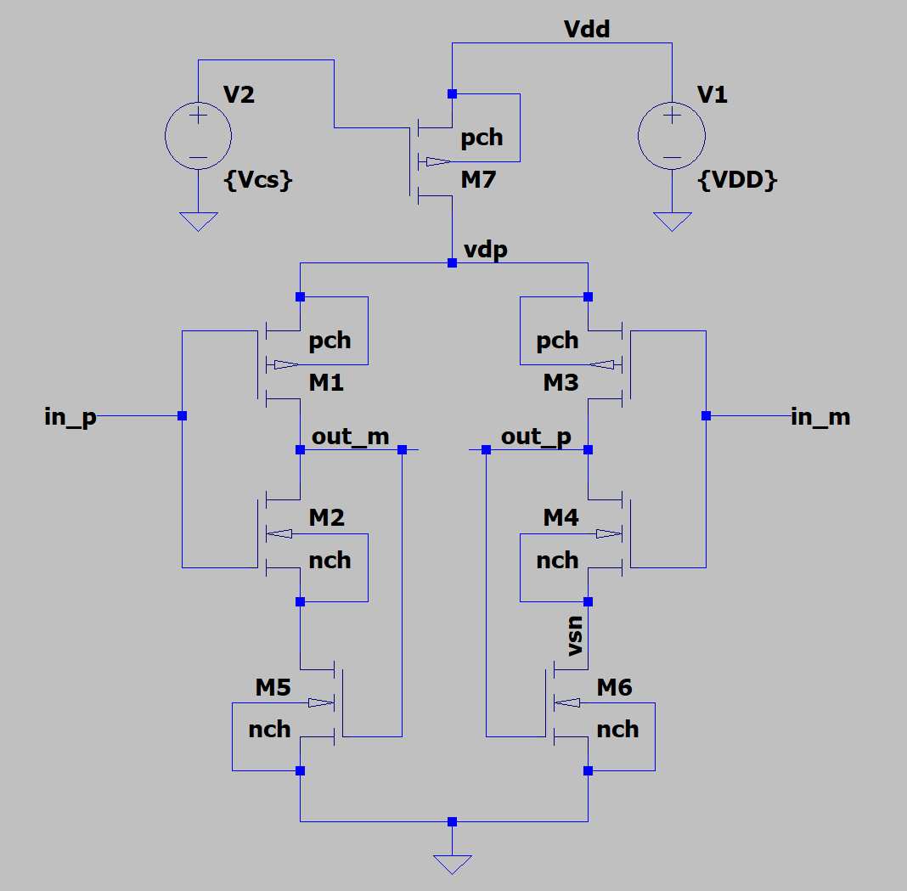

This design matches our current design extremely closely, and overall has the same functionality. Two CMOS amplifiers voltages feed into the gates of a pair of NMOS's which control the current flowing through the respective CMOS. The CMOS' amplified voltages feed into the repective NMOS, which control the current flowing through that CMOS. This feedback works as a sort of common mode correction.

This new design had far better bandwidth, but had issues with gain. After tweaking the Widths and Lengths more, we arrived at a final maximum gain of 28dB (with a 20mV input differential at 0.9V common mode).
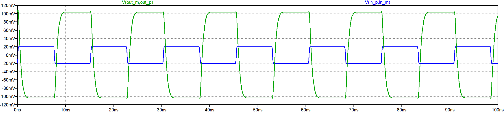

Additionally, this design was extremely sensitive to changes in the input voltage differential. Shifts in input common mode result in a shift in output common mode. The following simulation shows maximum voltage (x-axis) vs. Common-Mode (y-axis), with 10mV steps of input differential from 10mV to 200mV.

### Design #3

Lastly, we were suggested to connect the sources of the CMOS NMOS' together. This makes the effective resistance of the source of the NMOS and the ground zero, which dramatically increases the gain of the CMOS inverter. As the CMOS's amplified voltages feed into the two NMOS's, which either reduce or increase the amount of current flowing through the circuit. This feedback works as a sort of common mode correction. This remarkably increased gain and made it so the output common mode is always 0.9V. After adjusting the widths/lengths to maximize gain, we were able to achieve a final gain of 33.7dB (with a 20mV input differential at 0.9V common mode). 

Additionally, we replace the current source from a MOSFET with a bias voltage, to a current mirror. The effect this has is to make the current far more consistent. Using a single MOSFET would make the current extremely sensitive to slight changes in V_T and other MOSFET parameters, whereas using a current mirror uses MOSFETs with matched geometries and uses a resistor as the main reference for the current, thus making the current far more predictable.

This design also was far more resistant to a change in input differential, along with better common-mode offset behaviour. The following simulation shows maximum voltage (x-axis) vs. Common-Mode (y-axis), with 10mV steps of input differential from 10mV to 200mV.

A common-mode offset on the input still creates a common-mode offset in the output however. Here is a simulation of the input common modes swept from 5V to 1.4V, at steps of 0.1V

### MOSFET Parameters
| MOSFET | Length | Width | 
|-------|-------|-------|
| Current Mirror PMOS | 180n | 10u |
| Inverter PMOS | 500n | 7u |
| Inverter NMOS | 500n | 1u |
| Feedback NMOS | 180n | 1u |

### Parameters (From LTSpice Simulations)
| Parameter | Value | Result / Comment | 
|-------|-------|-------|
| Sensitivity | 32mV | Assuming a minimum logic-high level of 1.5V, this level is reached (at ideal 0.9V common mode) at a 35mV voltage differential |
| Gain | 31.5dB | Using values above (32mV differential input, 1.2V differential output). Far lower than initially planned, but the inital value was found to be unecessary, as from testing, the input voltage differential could be as high as 800mV |
| Speed | 0.125V/ns slew rate | Far higher than expected or needed |
| Power Consumption | 270uW | typical voltage draw of around 150uA. Total power is 150uA * 1.8V = 270uW |

Our initial values for widths and lengths were using a current mirror with far too long lengths, which made layout unfeasible. After a quick redesign, and strategically using multiplicity and fingers to compress the size of our MOFSETS, we arrived at the following layout, with the following simulation
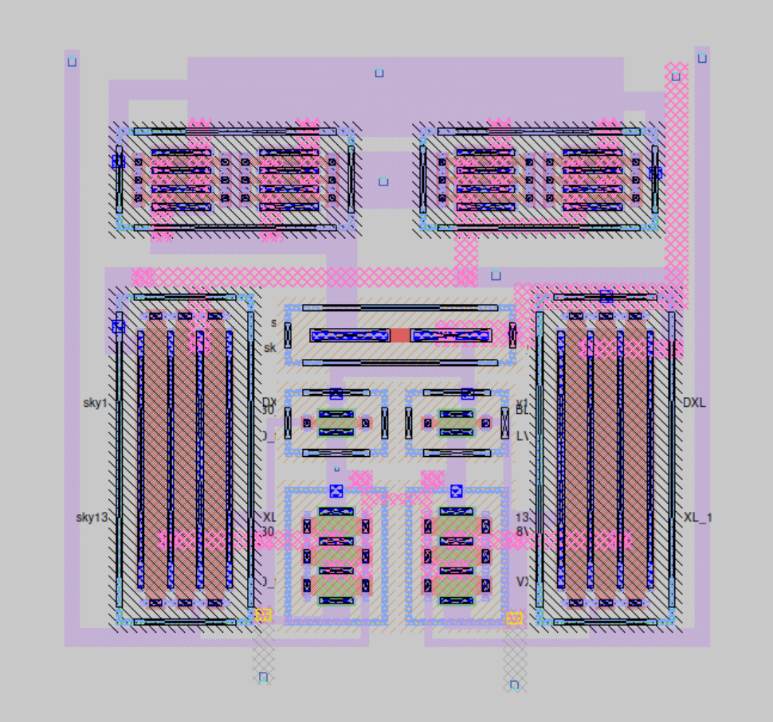
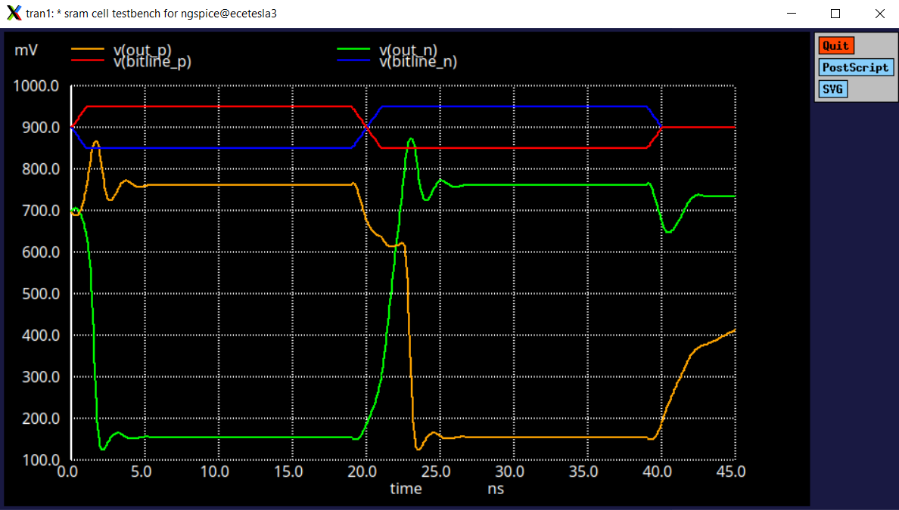

As you may have noticed, the results of the layout simulation are completely different from that of the LTSpice simulations. The inclusion of parasitics have had a massive effect on our circuit. Mainly, the gain seems to be severely reduced, and the common-mode of the output signals seems to have shifted from 0.9V to 0.5V. This is most likely a result of the parasitic resitances of the connections causing unexpected voltage drops throughout the circuit, resulting in the output voltages to be far lower than the ideal case.

There were two ways that we thought of to try to fix this issue.

Through testing in LTSpice, we found that increasing the amount of current flowing through the circuit shifts the common mode of the output upwards. This can be achieved by reducing the size of the resistor in the current mirror. As can be seen in this LTSpice simulation, by reducing the size of the resistor from 10k to 1k, the common mode of the output sits closer to 1.2V. Though this would not have improved the gain, the circuit should still be functional so long as the common mode is correct.
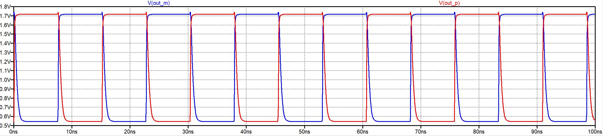

After making this change in the layout however, we found that it unfortunately had a marginal effect on the common mode of the output. (Left: 1.5k Resistor, Right: 5k Resistor)
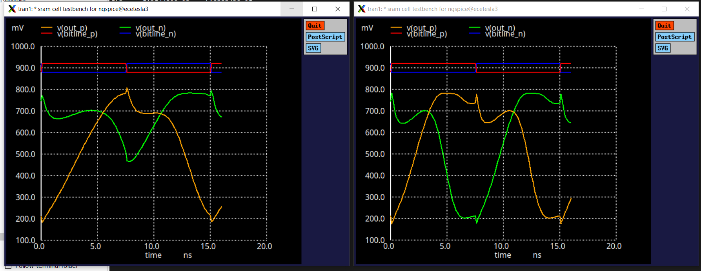

The other way we found to fix this was to implement a CMOS amplifier on the outputs. This inverter would have a midpoint voltage of 0.5V and would convert the reduced and off-centre outputs of our inverter back to the expected rail-to-rail swing. We found that an NMOS width of 20um and a PMOS width of 1um (according to LTSPice) gets us a CMOS centered at 0.5V.
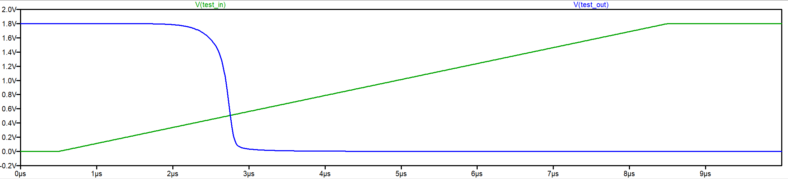
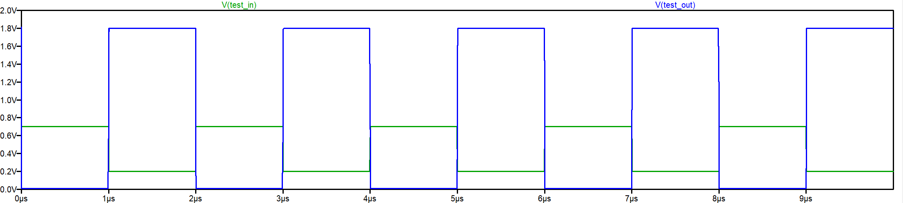

Here is the updated layout with the CMOS inverter (which we had to do TWICE since for some reason my original file got corrupted after like 4 hours of work trying to make it look neat. This second attempt is noticably far less elegant).
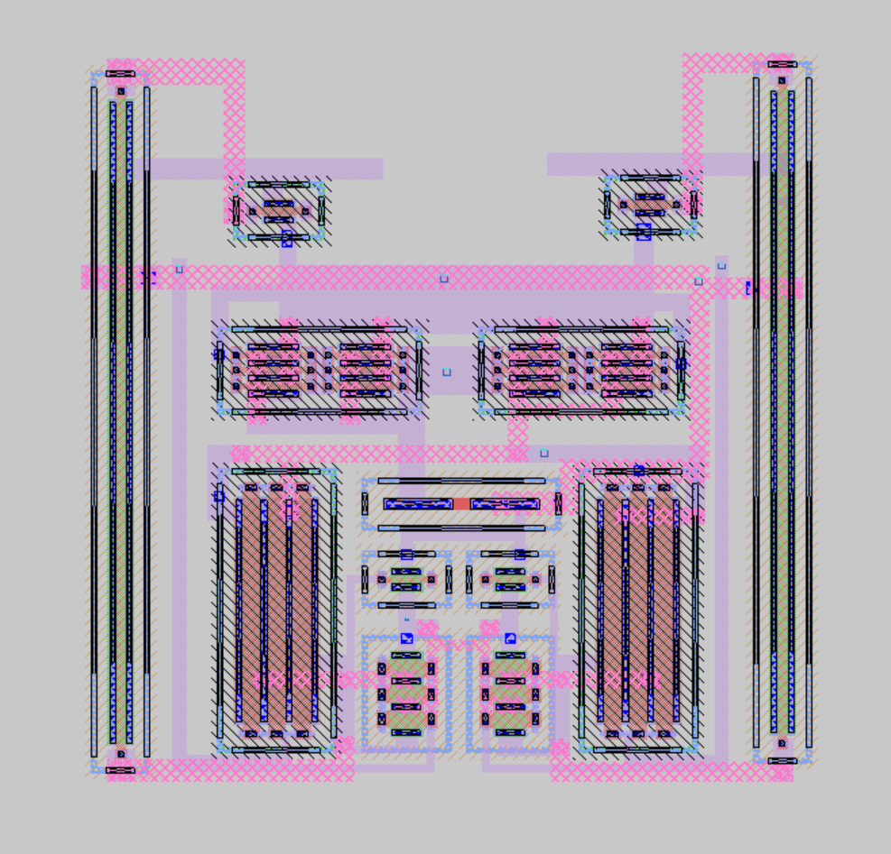

## Final Design & Parameters

### MOSFET Parameters
| MOSFET | Length | Width | 
|-------|-------|-------|
| Current Mirror PMOS | 180n | 10u |
| Inverter PMOS | 500n | 7u |
| Inverter NMOS | 500n | 1u |
| Feedback NMOS | 180n | 1u |
| *Secondary Amp NMOS | 180n | 20u |
| *Secondary Amp PMOS | 180n | 1u |

### *Functional Parameters (From NGSpice Simulations)
| Parameter | Value | Result / Comment |
|-------|-------| |
| Gain | 15dB | The LTSpice tests assume a input differential of 32mV. The NGSpice tests were conducted at a slightly more realistic value of 100mV, thus reducing the overall gain  |
| Speed | 0.125V/ns slew rate | |
| **Power Consumption | 270uW | |

*The secondary amplifiers haven't yet been tested, so these parameters are for the orignal layout with the non-ideal common mode
** Power consumption wasn't included in our NGSpice simulation. This value assumes a simular value to the LTSpice simulation
